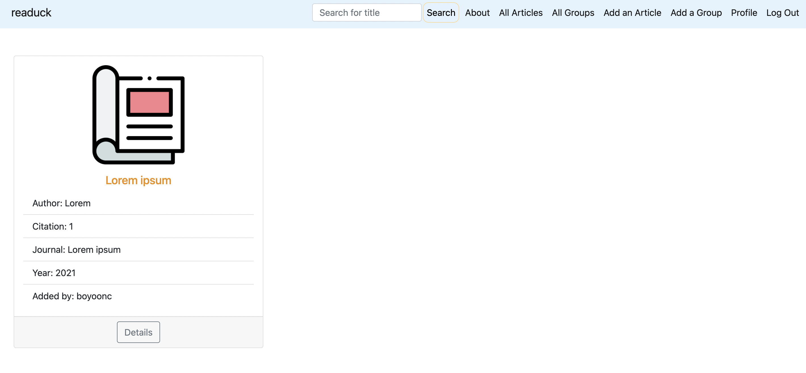

# readuck

## Description 
test
**readuck** is a place where researchers across the world get together and share their thoughts. 

At **readuck**, researchers can discuss acadmic journal articles to produce/develop/improve and refine their papers so that their products could be more useful to the society. 

## Getting Started
- [Trello Board](https://trello.com/b/WBR9gIDd/readuck)
- [ERD](https://whimsical.com/readuck-Y2tuqvYdEP2X1RFNjtZUQz)
- [Wireframe](https://www.figma.com/file/nKh0FdCiOkLCkbLBOE5BRY/readuck?node-id=1%3A2)
- [Deployed App](https://readuck.herokuapp.com)

## Screenshots

- Landing Page

- Articles Index Page

- Article Details Page

- Groups Index Page

- Group Details Page

- Profie Page

## Technologies
- Django
- Python
- PostgreSQL
- Amazon S3
- Bootstrap
- CSS, HTML, Javascript
- Figma, Lottie

## Next Steps
- [ ] Group authentication
- [ ] Connect it with an outsourced API to expand the database
- [ ] Enable searching for review contents as well as reply contents

## Resources
- Duckie in glasses front: https://www.dreamstime.com/rubber-yellow-duck-sunglasses-icon-isolated-rubber-yellow-duck-sunglasses-icon-isolated-white-background-image210811907 
- Duckie in glasses side: https://www.dreamstime.com/rubber-yellow-duck-sunglasses-icon-isolated-rubber-yellow-duck-sunglasses-icon-isolated-white-background-image210811839 
- Walking duck published by Richard Sahala Hartanto: https://lottiefiles.com/49879-walking-duck
- Paper icon: https://www.flaticon.com/free-icon/article_2554322?term=journal%20article&related_id=2554322
- White and black paper lot photo published by Annie Spratt: https://unsplash.com/photos/_dAnK9GJvdY 

